# Modul 03: Random Forest dengan Data Numerik dan Kategorikal

## Tujuan

Setelah menyelesaikan praktikum ini, mahasiswa diharapkan mampu:

1. Membedakan data numerik dan data kategorikal.
2. Menyiapkan feature numerik dan kategorikal untuk Machine Learning.
3. Mengubah data kategorikal menjadi bentuk numerik menggunakan `OneHotEncoder`.
4. Menggabungkan preprocessing dan Random Forest menggunakan `Pipeline`.
5. Melatih dan mengevaluasi model klasifikasi menggunakan Random Forest.

## Persiapan

Sebelum memulai praktikum, siapkan:

- Google Colab.
- Google Drive.
- Dataset `diabetes.csv`.
- Library Python `pandas` dan `scikit-learn`.
- Pemahaman dasar mengenai Random Forest dari Modul 02.

Dataset dapat diunduh melalui tautan berikut:

[📥 Download diabetes.csv](data/diabetes.csv)

!!! tip "Persiapan Dataset"
    Download dataset kemudian simpan pada folder `praktikum_ai` di Google Drive.

    Contoh lokasi file: `MyDrive/praktikum_ai/diabetes.csv`

!!! note "Prasyarat"
    Pada Modul 02 kita telah membuat model Random Forest menggunakan feature numerik.

    Pada modul ini kita akan menggunakan **feature numerik dan kategorikal secara bersamaan**.

---

## Langkah-langkah Praktikum

### 1. Menghubungkan Google Drive

Hubungkan Google Colab dengan Google Drive.

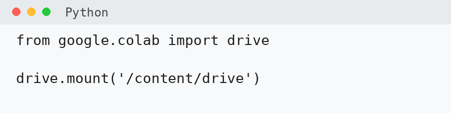

Setelah berhasil terhubung, file pada Google Drive dapat diakses melalui `/content/drive/MyDrive/`.

---

### 2. Membaca Dataset

Import library Pandas.

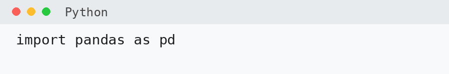

Tentukan lokasi dataset.

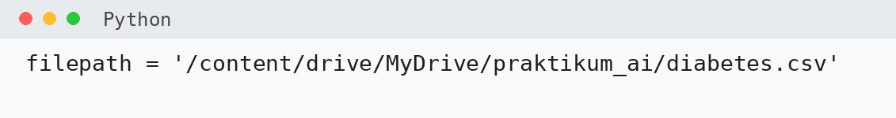

Baca dataset menggunakan `pd.read_csv()`.

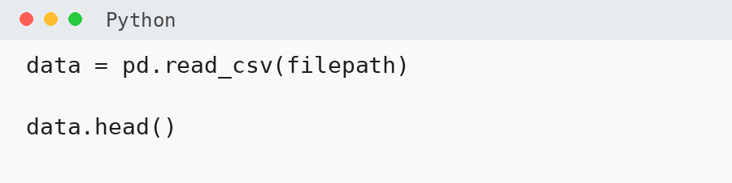

---

### 3. Melihat Informasi Dataset

Periksa ukuran dataset.

Kemudian lihat informasi setiap kolom.

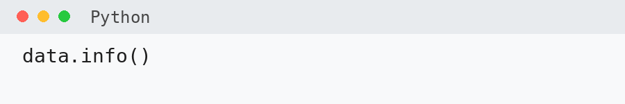

Dataset memiliki beberapa atribut berikut:

- `gender`
- `age`
- `hypertension`
- `heart_disease`
- `smoking_history`
- `bmi`
- `HbA1c_level`
- `blood_glucose_level`
- `diabetes`

Periksa beberapa data pertama.

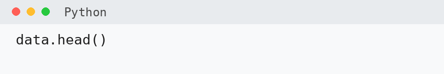

!!! question "Coba Amati"
    Berdasarkan hasil `data.info()`, kolom mana yang memiliki tipe data `int64`, `float64`, dan `object`?

---

### 4. Mengenal Data Numerik dan Kategorikal

#### Data Numerik

Data numerik merupakan data berbentuk angka yang memiliki nilai kuantitatif.

| Feature | Contoh Nilai |
|---|---:|
| `age` | 45 |
| `bmi` | 27.5 |
| `HbA1c_level` | 6.1 |
| `blood_glucose_level` | 140 |

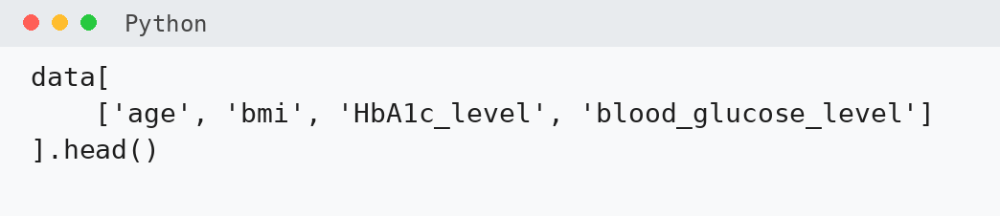

Data numerik dapat berupa `int64` untuk bilangan bulat dan `float64` untuk bilangan desimal.

#### Data Kategorikal

Data kategorikal merupakan data yang menunjukkan kelompok atau kategori tertentu.

| Feature | Contoh Nilai |
|---|---|
| `gender` | Male |
| `gender` | Female |
| `smoking_history` | never |
| `smoking_history` | former |

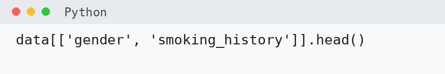

Lihat kategori pada kolom `gender`.

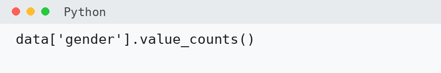

Lihat kategori pada kolom `smoking_history`.

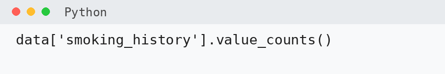

!!! note "Tentang hypertension"
    Kolom `hypertension` memiliki nilai `0` dan `1`. Secara konsep, nilai tersebut menunjukkan dua kategori, tetapi datanya sudah berbentuk numerik sehingga pada praktikum ini dapat digunakan langsung tanpa encoding tambahan.

---

### 5. Menentukan Feature dan Target

Dalam Machine Learning, dataset biasanya dibagi menjadi dua bagian utama:

- **Feature (X)**: data yang digunakan sebagai input oleh model.
- **Target (y)**: nilai atau kelas yang ingin diprediksi oleh model.

Pada praktikum ini, kita ingin memprediksi `diabetes`.

| Peran | Kolom |
|---|---|
| **Feature numerik (X)** | `age`, `hypertension`, `bmi`, `HbA1c_level`, `blood_glucose_level` |
| **Feature kategorikal (X)** | `gender`, `smoking_history` |
| **Target (y)** | `diabetes` |

!!! note "Ingat"
    **X** berisi informasi yang digunakan model untuk belajar, sedangkan **y** berisi nilai yang ingin diprediksi oleh model.

#### Menentukan Feature Numerik

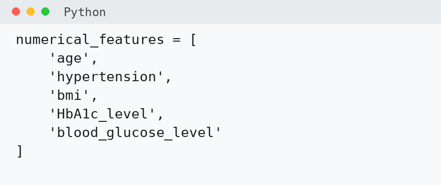

#### Menentukan Feature Kategorikal

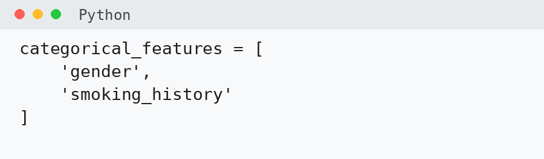

#### Membuat Feature X

Gabungkan seluruh feature numerik dan kategorikal.

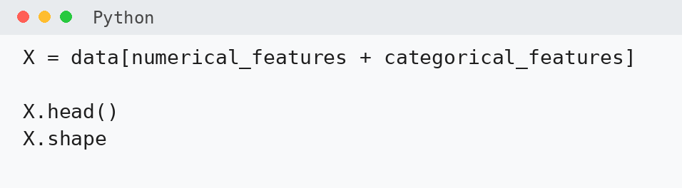

#### Membuat Target y

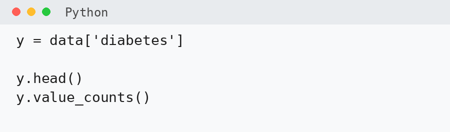

Pada dataset ini:

- `0` = tidak diabetes
- `1` = diabetes

!!! question "Coba Amati"
    Apakah jumlah data dengan `diabetes = 0` dan `diabetes = 1` seimbang? Kelas mana yang lebih banyak?

#### Memeriksa Feature dan Target

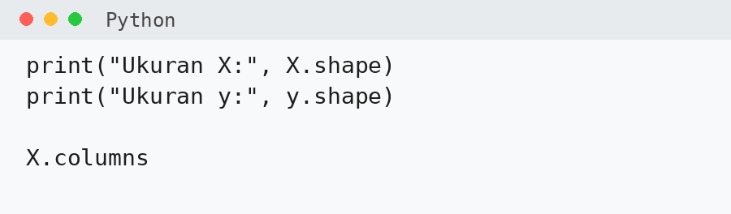

!!! tip "Tips"
    Sebelum membuat model, selalu periksa feature yang digunakan, target yang ingin diprediksi, jumlah data `X` dan `y`, serta tipe data pada setiap feature.

---

### 6. Mengapa Data Kategorikal Perlu Diubah?

Perhatikan data pada kolom `gender`.

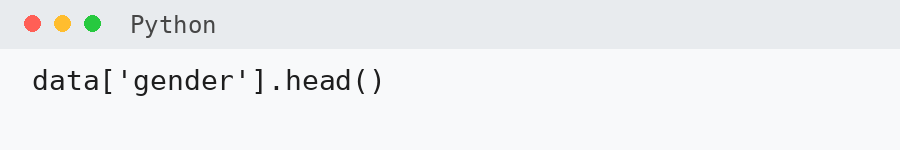

Model Machine Learning pada umumnya bekerja dengan data numerik. Karena itu, data kategorikal seperti `Male`, `Female`, `never`, `former`, dan `current` perlu diubah menjadi bentuk numerik.

Salah satu metode yang dapat digunakan adalah **One-Hot Encoding**.

Contoh:

| gender | gender_Female | gender_Male |
|---|---:|---:|
| Male | 0 | 1 |
| Female | 1 | 0 |

---

### 7. Membuat Transformer Data Kategorikal

Import `OneHotEncoder` dan buat transformer.

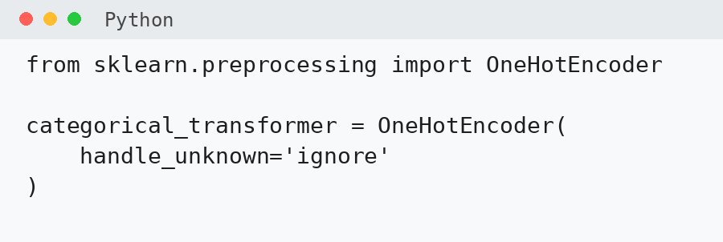

Parameter `handle_unknown='ignore'` digunakan agar model tetap dapat memproses data jika menemukan kategori yang tidak terdapat pada data training.

---

### 8. Membuat Preprocessor dengan ColumnTransformer

Feature yang digunakan memiliki dua tipe:

- **Numerik** → digunakan langsung.
- **Kategorikal** → diproses menggunakan `OneHotEncoder`.

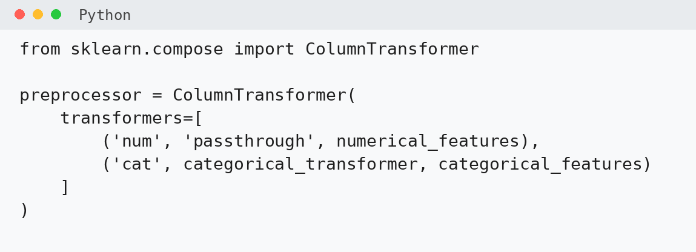

Pada bagian `'passthrough'`, feature numerik digunakan langsung tanpa transformasi.

!!! note "Mengapa Tidak Menggunakan StandardScaler?"
    Random Forest merupakan model berbasis decision tree sehingga tidak bergantung pada jarak antar-data. Oleh karena itu, perbedaan skala antar-feature tidak menjadi masalah utama.

---

### 9. Membagi Data Training dan Testing

Dataset dibagi menjadi **training data** untuk melatih model dan **testing data** untuk mengevaluasi model.

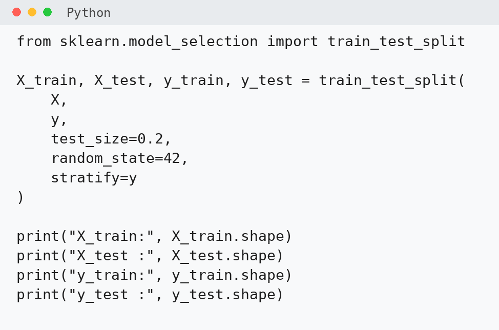

!!! note "Parameter"
    `test_size=0.2` berarti 20% data digunakan sebagai testing data.

    `random_state=42` digunakan agar pembagian data dapat direproduksi.

    `stratify=y` digunakan agar proporsi kelas pada training dan testing tetap menyerupai dataset awal.

---

### 10. Membuat Pipeline

Kita akan menggabungkan preprocessing dan Random Forest menggunakan `Pipeline`.

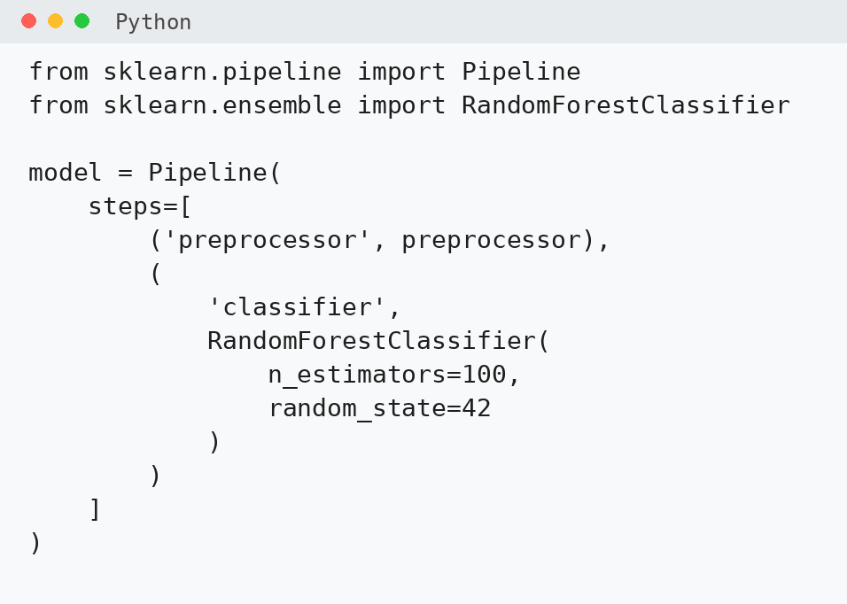

Dengan Pipeline, preprocessing dan training dilakukan dalam satu alur:

1. feature numerik digunakan langsung,
2. feature kategorikal diubah dengan One-Hot Encoding,
3. seluruh feature digabungkan,
4. data digunakan oleh Random Forest.

!!! tip "Mengapa Menggunakan Pipeline?"
    Pipeline membantu memastikan preprocessing yang sama diterapkan saat model dilatih maupun saat digunakan untuk melakukan prediksi.

---

### 11. Melatih Model

Gunakan fungsi `fit()` untuk melatih model.

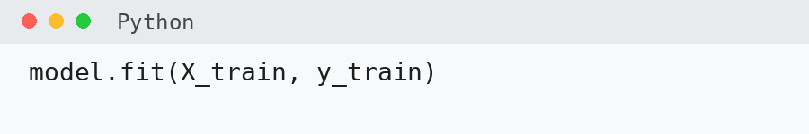

---

### 12. Melakukan Prediksi

Gunakan model untuk memprediksi data testing.

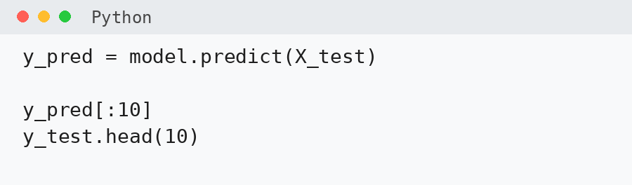

---

### 13. Membandingkan Prediksi dengan Nilai Sebenarnya

Buat tabel sederhana untuk membandingkan hasil prediksi dengan label sebenarnya.

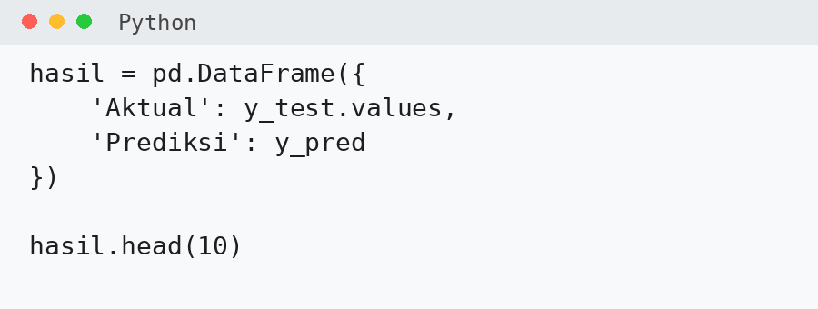

!!! question "Coba Amati"
    Dari 10 data pertama, berapa prediksi yang benar?

---

### 14. Menghitung Accuracy

Hitung nilai accuracy.

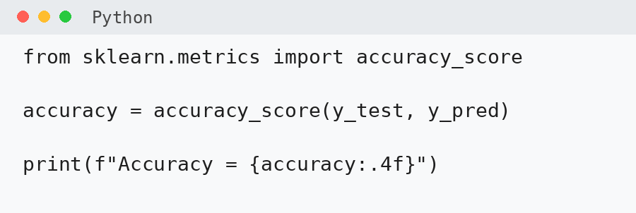

Accuracy menunjukkan proporsi prediksi yang benar dibandingkan dengan seluruh data testing.

!!! warning "Accuracy Bukan Satu-satunya Ukuran"
    Accuracy yang tinggi belum tentu menunjukkan bahwa model bekerja dengan baik untuk setiap kelas, terutama jika jumlah data pada masing-masing kelas tidak seimbang.

---

### 15. Membandingkan dengan Baseline

Sebagai pembanding, hitung proporsi kelas terbesar pada data testing.

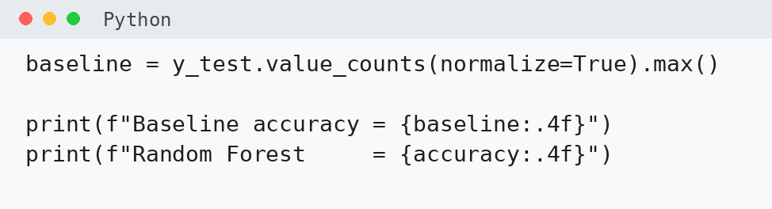

!!! question "Coba Analisis"
    Apakah Random Forest menghasilkan accuracy yang lebih tinggi dibandingkan baseline?

---

### 16. Membandingkan dengan Modul 02

Pada Modul 02, Random Forest hanya menggunakan feature numerik. Pada modul ini, model menggunakan feature numerik **dan** kategorikal.

!!! question "Coba Analisis"
    Apakah penambahan `gender` dan `smoking_history` meningkatkan accuracy model?

    Apakah menambahkan lebih banyak feature selalu membuat model menjadi lebih baik?

---

## Ringkasan

Pada praktikum ini kita telah melakukan proses berikut:

1. membaca dataset,
2. menentukan feature dan target,
3. memisahkan feature numerik dan kategorikal,
4. melakukan One-Hot Encoding pada feature kategorikal,
5. menggabungkan preprocessing dengan `ColumnTransformer`,
6. membagi data menjadi training dan testing,
7. membuat Pipeline,
8. melatih Random Forest,
9. melakukan prediksi,
10. mengevaluasi model menggunakan accuracy.

Kode utama praktikum ditampilkan pada gambar berikut.

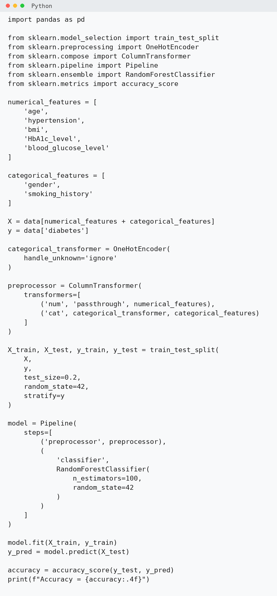

---

# Tugas Praktikum

Kerjakan tugas berikut secara mandiri menggunakan Google Colab.

## 1. Mengubah Feature

Tambahkan feature `heart_disease` ke dalam kelompok feature numerik.

Latih kembali model dan catat nilai accuracy yang diperoleh.

---

## 2. Membandingkan Model

Bandingkan dua model berikut:

| Model | Feature |
|---|---|
| Model A | Feature pada praktikum |
| Model B | Feature pada praktikum + `heart_disease` |

Catat accuracy masing-masing model.

| Model | Accuracy |
|---|---:|
| Model A | ... |
| Model B | ... |

Apakah penambahan feature `heart_disease` meningkatkan accuracy?

---

## 3. Mengubah Jumlah Decision Tree

Coba Random Forest dengan:

- `n_estimators = 50`
- `n_estimators = 100`
- `n_estimators = 200`

Catat hasilnya.

| n_estimators | Accuracy |
|---:|---:|
| 50 | ... |
| 100 | ... |
| 200 | ... |

---

## 4. Menguji Prediksi

Ambil satu data dari `X_test`.

Tampilkan:

- nilai feature,
- hasil prediksi,
- nilai sebenarnya.

Tuliskan apakah hasil prediksi tersebut benar atau salah.

---

## 5. Kesimpulan

Tuliskan kesimpulan maksimal **3 kalimat** mengenai:

- penggunaan feature numerik dan kategorikal,
- fungsi One-Hot Encoding,
- manfaat Pipeline dalam proses Machine Learning.

---

## Pengumpulan

Simpan notebook pada Google Drive dan kumpulkan dalam format `.ipynb`.

Gunakan format nama file:

`NIM_Nama_Modul03.ipynb`

Pastikan seluruh cell telah dijalankan dan output dapat terlihat sebelum notebook dikumpulkan.
